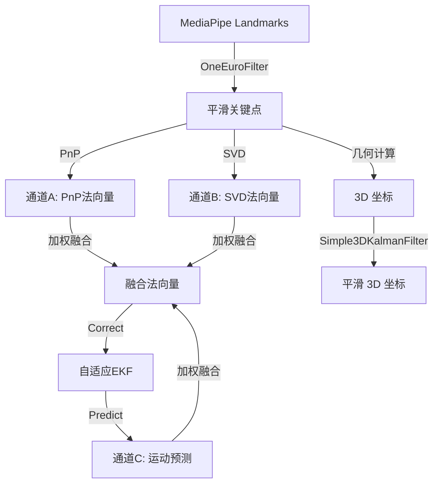

# 系统架构文档

## 1. 总体架构

FrustumGaze 采用多进程架构设计，旨在解决 Python 在处理高分辨率视频流和复杂计算机视觉任务（MediaPipe）时的性能瓶颈（GIL）。

核心设计理念：
*   **主进程 (Main Process)**: 负责视频采集、渲染显示、任务分发、数据聚合与网络发送。
*   **子进程 (Worker Processes)**: 负责耗时的计算机视觉计算（人脸追踪、手部追踪）。
*   **共享内存 (Shared Memory)**: 用于在进程间高效传输图像数据，避免序列化/反序列化的开销。
*   **队列 (Queues)**: 用于轻量级的任务指令和结果传递。

### 架构图

```mermaid
graph TD
    Camera[摄像头输入] -->|Capture| Main[主进程 (Pipeline)]
    Main -->|写入| SharedMem[共享内存 (Double Buffer)]
    
    subgraph "主进程 (Main)"
        Main -->|Visualizer| Display[屏幕显示]
        Main -->|UDPSender| Unity[Unity 客户端]
    end
    
    subgraph "人脸追踪子进程 (Face Process)"
        SharedMem -->|读取| FaceTask[FaceLandmarker]
        FaceTask -->|Gaze Math| EyeCalc[EyeTracker]
        EyeCalc -->|结果| FaceQueue[结果队列]
    end
    
    subgraph "手部追踪子进程 (Hand Process)"
        SharedMem -->|读取| HandTask[HandLandmarker]
        HandTask -->|Filter| HandFilter[OneEuro/Kalman]
        HandFilter -->|结果| HandQueue[结果队列]
    end
    
    Main -->|Task Queue| FaceTask
    Main -->|Task Queue| HandTask
    FaceQueue -->|Result| Main
    HandQueue -->|Result| Main
```

## 2. 核心模块详解

### 2.1 Pipeline (`modules/pipeline.py`)

`FrustumGazePipeline` 是系统的核心控制器，负责整个应用程序的生命周期管理。

#### 主要职责
1.  **初始化 (`setup`)**:
    *   自动选择最佳摄像头 API (DSHOW, MSMF 等)。
    *   配置摄像头参数（分辨率、曝光、FPS）。
    *   申请双缓冲共享内存 (`SharedMemory`)。
    *   初始化网络发送模块 (`UDPSender`) 和可视化模块 (`Visualizer`)。
2.  **进程管理 (`start_processes`, `stop`)**:
    *   创建并启动 `FaceProcessorProcess`, `HandProcessorProcess`, `PoseProcessorProcess`。
    *   处理优雅退出，确保释放所有资源（摄像头、共享内存、子进程）。
3.  **主循环 (`run`)**:
    *   **视频采集**: 从摄像头读取每一帧。
    *   **数据分发**: 将帧数据写入共享内存，并通过 `input_queue` 向子进程发送任务指令（包含 Frame ID 和 Buffer Index）。
    *   **结果收集**: 非阻塞地检查 `output_queue`，获取最新的追踪结果（人脸、手势、姿态）。
    *   **数据同步**: 聚合来自不同子进程的数据。
    *   **可视化**: 调用 `Visualizer` 绘制追踪结果、FPS、调试信息。
    *   **网络发送**: 将处理后的结构化数据通过 UDP 发送给 Unity 客户端。

### 2.2 共享内存机制 (`modules/shared_mem.py`)

为了在进程间高效传输 1080p+ 的图像数据，系统使用了 `multiprocessing.shared_memory`。

*   **双缓冲 (Double Buffering)**: 创建两个共享内存块 (`frustum_gaze_frame_buffer_0`, `_1`)。
    *   主进程写入 Buffer A 时，子进程可能正在读取 Buffer B，反之亦然。
    *   通过 Buffer Index 在队列中传递当前帧所在的内存块索引。
*   **Zero-Copy**: 子进程直接通过 `numpy.ndarray` 映射访问共享内存，无需数据拷贝，极大降低了延迟。

### 2.3 追踪器模块 (`trackers/`)

所有追踪逻辑封装在独立的子进程中，通过继承 `multiprocessing.Process` 实现。

#### 2.3.1 人脸追踪 (`trackers/face_mesh.py`)
*   **类名**: `FrameProcessorProcess`
*   **核心功能**:
    *   **MediaPipe Face Mesh**: 运行高精度人脸关键点检测。
    *   **智能 ROI 策略**:
        *   **全图扫描 (Detection)**: 初始状态或丢失追踪时，对全图降分辨率进行扫描。
        *   **ROI 追踪 (Tracking)**: 一旦检测到人脸，下一帧仅裁剪人脸周围区域（ROI）进行检测，显著提升 FPS。
    *   **视线解算**: 内部集成 `EyeTracker`，在子进程中直接计算 3D 视线向量和头部姿态，减轻主进程负担。
    *   **图像预处理**: 使用 CLAHE (自适应直方图均衡化) 增强对比度，提高在暗光环境下的鲁棒性。

#### 2.3.2 手部追踪 (`trackers/hand_tracker.py`)
*   **类名**: `HandProcessorProcess`
*   **核心功能**:
    *   **MediaPipe Hands**: 检测手部 21 个关键点。
    *   **独立 ROI**: 类似于人脸，手部也有独立的 ROI 追踪逻辑。
    *   **平滑滤波**:
        *   **OneEuroFilter**: 处理高频抖动（Jitter）。
        *   **Simple3DKalmanFilter**: 处理 3D 位置的平滑。
        *   **AdaptiveEKF**: 专用于手掌法向量的自适应滤波，支持动态噪声调整和球坐标系追踪。
    *   **手势识别**: 简单的捏合（Pinch）检测。

#### 2.3.3 姿态追踪 (`trackers/pose_tracker.py`)
*   **类名**: `PoseProcessorProcess`
*   **核心功能**:
    *   **MediaPipe Pose**: 检测身体骨骼关键点。
    *   通常运行频率较低（如每 3-5 帧一次），用于辅助全身姿态估计。

#### 2.3.4 视线算法基类 (`trackers/eye_tracker.py`)
*   **类名**: `EyeTracker`
*   **功能**: 这是一个数学计算辅助类，而非独立进程。
    *   **solvePnP**: 利用 2D 人脸关键点和 3D 通用人脸模型，解算头部旋转和平移向量 (rvec, tvec)。
    *   **数据滤波**: 对关键点坐标和计算出的距离/角度进行多级滤波。
    *   被 `FaceProcessorProcess` 实例化并调用。

## 3. 坐标系转换

系统涉及多个坐标系的转换：

1.  **图像坐标系 (2D)**: 像素单位 (0,0) 到 (Width, Height)。
2.  **相机坐标系 (3D)**: OpenCV 标准，X 右，Y 下，Z 前。
3.  **模型坐标系 (3D)**: 用于 solvePnP 的标准化人脸 3D 模型。
4.  **Unity 坐标系 (3D)**: 左手坐标系，Y 上，Z 前。

**注意**: Python 端主要输出 **相机坐标系** 下的数据。Unity 接收端脚本 (`Camera/VirtualWindowController.cs`) 负责将其转换为 Unity 世界坐标系。

## 4. 性能优化策略

1.  **多进程并行**: 将 CPU 密集的 MediaPipe 推理剥离到子进程，主进程专注于 I/O 和渲染。
2.  **动态 ROI**: 仅在感兴趣区域进行检测，避免全图推理，MediaPipe 速度提升 2-3 倍。
3.  **跳帧策略**: 允许配置追踪频率（如每 2 帧追踪一次），中间帧使用插值或卡尔曼滤波预测。
4.  **Zero-Copy 共享内存**: 消除进程间图像传输的开销。
5.  **MJPEG 视频流**: 摄像头采集使用 MJPEG 格式，减少 USB 带宽占用，提高帧率。

## 5. 滤波策略详解 (Filtering Strategy)

为了解决由于光照变化、传感器噪声以及计算机视觉模型本身的抖动带来的数据不稳定性，系统实施了多级滤波策略。

### 5.1 滤波器类型

1.  **OneEuroFilter (一欧元滤波器)**
    *   **原理**: 一种自适应的一阶低通滤波器。在低速运动时降低截止频率以减少抖动（高平滑），在高速运动时提高截止频率以减少延迟（高响应）。
    *   **应用场景**: 2D 关键点坐标、旋转角度（Yaw）、手部归一化距离。
    *   **核心参数**: `min_cutoff` (最小截止频率), `beta` (速度系数), `d_cutoff` (导数截止频率)。

2.  **Simple3DKalmanFilter (简单 3D 卡尔曼滤波器)**
    *   **原理**: 标准线性卡尔曼滤波，用于平滑 3D 空间坐标 (X, Y, Z)。假设匀速运动模型。
    *   **应用场景**: 手部最终输出的 3D 世界坐标。
    *   **核心参数**: `process_noise` (过程噪声 Q), `measurement_noise` (测量噪声 R)。

3.  **OneDKalmanFilter (一维卡尔曼滤波器)**
    *   **原理**: 针对标量值的一维卡尔曼滤波。
    *   **应用场景**: 人脸距离估算 (`dist`)、人脸中心偏移量 (`offset_x`, `offset_y`)。

4.  **AdaptiveEKF (自适应扩展卡尔曼滤波器)**
    *   **原理**: 基于球坐标系 $(\theta, \phi)$ 的扩展卡尔曼滤波，观测噪声 $R$ 根据置信度 $q$ 动态缩放。
    *   **应用场景**: 手掌法向量 (Normal Vector) 追踪。
    *   **核心机制**: 
        *   $R \propto 1/q^2$: 低置信度时依赖预测。
        *   奇异性处理: 在极点附近抑制方位角噪声。

### 5.2 滤波流程

#### 5.2.1 人脸追踪 (Face Tracking)

```mermaid
graph LR
    Raw[MediaPipe Landmarks] -->|OneEuroFilter| SmoothLandmarks[平滑关键点]
    SmoothLandmarks -->|PnP Solver| Pose[头部姿态 (R, T)]
    Pose -->|计算| Dist[距离估算]
    Dist -->|OneDKalmanFilter| SmoothDist[平滑距离]
    Pose -->|计算| Offset[中心偏移]
    Offset -->|OneDKalmanFilter| SmoothOffset[平滑偏移]
```

*   **关键点级**: 对参与 PnP 解算的 6 个关键点 (眼角、鼻尖、嘴角等) 先进行 `OneEuroFilter` 滤波，减少输入噪声。
*   **数据级**: 解算出的距离和偏移量再次经过 `OneDKalmanFilter`，确保数值输出的稳定性，避免 UI 忽大忽小。

#### 5.2.2 手部追踪 (Hand Tracking)



*   **关键点级**: 对指尖和手掌中心等关键点进行 `OneEuroFilter`。
*   **法向量融合**:
    *   **通道 A/B/C**: 分别计算 PnP、SVD 和预测法向量。
    *   **加权融合**: 根据置信度 $q$ 合成最终法向量。
    *   **反馈回路**: 融合结果作为观测值输入 `AdaptiveEKF`，更新滤波器状态以供下一帧预测。
*   **位置平滑**: 3D 坐标通过 `Simple3DKalmanFilter` 进行平滑。

### 5.3 参数调优

所有滤波参数均在 `config/settings.py` 中集中管理，可根据实际体验进行微调：

*   **减少抖动**: 降低 `min_cutoff`，增加 `beta` (OneEuro); 减小 `process_noise`，增大 `measurement_noise` (Kalman)。
*   **降低延迟**: 增大 `min_cutoff` (OneEuro); 增大 `process_noise` (Kalman)。
