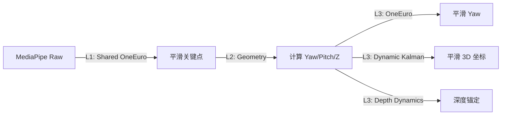
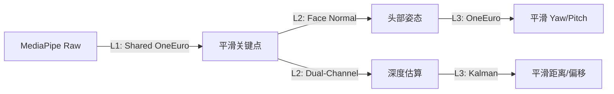

# 系统架构文档

## 1. 总体架构

FrustumGaze 采用多进程架构设计，旨在解决 Python 在处理高分辨率视频流和复杂计算机视觉任务（MediaPipe）时的性能瓶颈（GIL）。

核心设计理念：
*   **主进程 (Main Process)**: 负责视频采集、渲染显示、任务分发、数据聚合与网络发送。
*   **子进程 (Worker Processes)**: 负责耗时的计算机视觉计算（人脸追踪、手部追踪）。
*   **共享内存 (Shared Memory)**: 用于在进程间高效传输图像数据，避免序列化/反序列化的开销。
*   **队列 (Queues)**: 用于轻量级的任务指令和结果传递。

### 架构图

```mermaid
graph TD
    Camera[摄像头输入] -->|Capture| Main[主进程 (Pipeline)]
    Main -->|写入| SharedMem[共享内存 (Triple Buffer)]
    
    subgraph "主进程 (Main)"
        Main -->|Visualizer| Display[屏幕显示]
        Main -->|UDPSender| Unity[Unity 客户端]
    end
    
    subgraph "人脸追踪子进程 (Face Process)"
        SharedMem -->|读取| FaceTask[FaceLandmarker]
        FaceTask -->|Gaze Math| EyeCalc[EyeTracker]
        EyeCalc -->|结果| FaceQueue[结果队列]
    end
    
    subgraph "手部追踪子进程 (Hand Process)"
        SharedMem -->|读取| HandTask[HandLandmarker]
        HandTask -->|Filter| HandFilter[OneEuro/Kalman]
        HandFilter -->|结果| HandQueue[结果队列]
    end
    
    Main -->|Task Queue| FaceTask
    Main -->|Task Queue| HandTask
    FaceQueue -->|Result| Main
    HandQueue -->|Result| Main
```

## 2. 核心模块详解

### 2.1 Pipeline (`modules/pipeline/manager.py`)

`FrustumGazePipeline` (位于 `manager.py`) 是系统的核心控制器，负责整个应用程序的生命周期管理。

#### 主要职责
1.  **初始化 (`setup`)**:
    *   自动选择最佳摄像头 API (DSHOW, MSMF 等)。
    *   配置摄像头参数（分辨率、曝光、FPS）。
    *   申请三缓冲共享内存 (`SharedMemory`)。
    *   初始化网络发送模块 (`UDPSender`)、可视化模块 (`Visualizer`) 和性能统计管理器 (`StatsManager`)。
2.  **进程管理 (`start_processes`, `stop`)**:
    *   创建并启动 `FrameProcessorProcess` (人脸), `HandProcessorProcess`, `PoseProcessorProcess`。
    *   处理优雅退出，确保释放所有资源（摄像头、共享内存、子进程）。
3.  **主循环 (`run`)**:
    *   **视频采集**: 从摄像头读取每一帧。
    *   **数据分发**: 将帧数据写入共享内存，并通过 `input_queue` 向子进程发送任务指令（包含 Frame ID 和 Buffer Index）。
    *   **结果收集**: 非阻塞地检查 `output_queue`，获取最新的追踪结果（人脸、手势、姿态）。
    *   **数据同步**: 聚合来自不同子进程的数据。
    *   **可视化**: 调用 `Visualizer` 绘制追踪结果、FPS、调试信息。
    *   **网络发送**: 将处理后的结构化数据通过 UDP 发送给 Unity 客户端。

### 2.2 共享内存机制 (`modules/shared_mem.py`)

为了在进程间高效传输 1080p+ 的图像数据，系统使用了 `multiprocessing.shared_memory`。

*   **三缓冲 (Triple Buffering)**: 创建三个共享内存块 (`frustum_gaze_frame_buffer_{session}_{0,1,2}`)。
    *   主进程维护一个原子索引 `triple_buffer_idx`，始终写入非最新的 buffer，读端从最新 buffer 读取，天然避免读写冲突。
    *   通过 Buffer Index 在队列中传递当前帧所在的内存块索引。
*   **Zero-Copy**: 子进程直接通过 `numpy.ndarray` 映射访问共享内存，无需数据拷贝，极大降低了延迟。

### 2.3 追踪进程与逻辑 (`modules/pipeline/` & `trackers/`)

所有追踪逻辑封装在独立的子进程中，均继承自 `BaseProcessorProcess`（`modules/pipeline/base_process.py`）。该基类封装了共享内存连接、主循环、队列交互和生命周期管理，子类只需实现 `on_init()` / `on_process()` / `on_cleanup()` 三个钩子。

#### 2.3.1 人脸追踪进程 (`modules/pipeline/face_process.py`)
*   **类名**: `FrameProcessorProcess`
*   **依赖**: `trackers/face_mesh.py` (FaceMeshTracker)
*   **核心功能**:
    *   **MediaPipe Face Mesh**: 运行高精度人脸关键点检测。
    *   **智能 ROI 策略**:
        *   **全图扫描 (Detection)**: 初始状态或丢失追踪时，对全图降分辨率进行扫描。
        *   **ROI 追踪 (Tracking)**: 一旦检测到人脸，下一帧仅裁剪人脸周围区域（ROI）进行检测，显著提升 FPS。
    *   **视线解算**: 内部集成 `EyeTracker`，在子进程中直接计算 3D 视线向量和头部姿态，减轻主进程负担。
    *   **图像预处理**: 使用 CLAHE (自适应直方图均衡化) 增强对比度，提高在暗光环境下的鲁棒性。

#### 2.3.2 手部追踪进程 (`modules/pipeline/hand_process.py`)
*   **类名**: `HandProcessorProcess`
*   **依赖**: `trackers/hand_tracker.py` (HandTracker)
*   **核心功能**:
    *   **MediaPipe Hands**: 检测手部 21 个关键点。
    *   **独立 ROI**: 类似于人脸，手部也有独立的 ROI 追踪逻辑。
    *   **平滑滤波**:
        *   **OneEuroFilter**: 处理高频抖动（Jitter）。
        *   **KalmanFilter**: 处理运动预测和平滑。
    *   **手势识别**: 简单的捏合（Pinch）检测。

#### 2.3.3 姿态追踪进程 (`modules/pipeline/pose_process.py`)
*   **类名**: `PoseProcessorProcess`
*   **核心功能**:
    *   **MediaPipe Pose**: 检测身体骨骼关键点。
    *   通常运行频率较低（如每 3-5 帧一次），用于辅助全身姿态估计。

#### 2.3.4 视线与头部追踪计算 (`trackers/eye_tracker.py`)
*   **类名**: `EyeTracker`
*   **功能**: 数学计算辅助类，而非独立进程，由 `FaceProcessorProcess` 实例化并调用。
    *   **头部姿态**: 使用面部法向量法（4 个特征点叉积），直接从法向量分量提取 Yaw/Pitch，再构建旋转矩阵。不使用 solvePnP。
    *   **头部深度**: 双通道融合（宽度通道 + 长度通道），结合动态校准。
    *   **视线计算**: 通过相机内参逆矩阵将 2D 眼球/虹膜坐标反投影为 3D 射线，利用射线-球面求交得到视线向量。
    *   **数据滤波**: 对关键点坐标和计算出的距离/角度进行多级 OneEuro / Kalman 滤波。
    *   **输出**: `GazeResult` dataclass，包含深度、偏移、姿态、视线向量、置信度、屏幕交点等。

## 3. 坐标系转换

系统涉及多个坐标系的转换：

1.  **图像坐标系 (2D)**: 像素单位 (0,0) 到 (Width, Height)。
2.  **相机坐标系 (3D)**: OpenCV 标准，X 右，Y 下，Z 前。
3.  **模型坐标系 (3D)**: 标准化人脸 3D 模型，用于视线几何计算中的眼球中心参考点定义（原点为鼻尖）。
4.  **Unity 坐标系 (3D)**: 左手坐标系，Y 上，Z 前。

**注意**: Python 端主要输出 **相机坐标系** 下的数据。Unity 接收端脚本 (`Camera/VirtualWindowController.cs`) 负责将其转换为 Unity 世界坐标系。

## 4. 性能优化策略

1.  **多进程并行**: 将 CPU 密集的 MediaPipe 推理剥离到子进程，主进程专注于 I/O 和渲染。
2.  **动态 ROI**: 仅在感兴趣区域进行检测，避免全图推理，MediaPipe 速度提升 2-3 倍。
3.  **跳帧策略**: 允许配置追踪频率（如每 2 帧追踪一次），中间帧使用插值或卡尔曼滤波预测。
4.  **Zero-Copy 共享内存**: 消除进程间图像传输的开销。
5.  **MJPEG 视频流**: 摄像头采集使用 MJPEG 格式，减少 USB 带宽占用，提高帧率。
6.  **资源监控 (可选)**: `StatsManager` 每秒采样一次进程 CPU / 内存占用（`psutil`）及 GPU 使用率（`GPUtil`），由 `Visualizer` 在画面右下角显示。两个依赖库均为可选，未安装时自动跳过监控，不影响核心功能。

## 5. 级联滤波策略 (Cascading Filter Strategy)

为解决传感器噪声、光照变化及模型抖动问题，系统采用**级联滤波架构 (Cascading Architecture)**，将滤波处理分为三个层级。

### 5.1 滤波器配置层级 (`config/settings.py`)

参数配置采用分层结构，确保逻辑清晰且易于维护：

*   **Level 1: 基础关键点滤波 (KEYPOINT)**
    *   **共享参数**: 手部和人脸的关键点共用一套 `OneEuroFilter` 参数。
    *   **目的**: 在进行任何几何计算前，先平滑 MediaPipe 的原始坐标数据，从源头抑制抖动。
    *   **核心参数**: `min_cutoff` (1.0Hz), `beta` (0.5)。

*   **Level 2 & 3: 高级数据滤波 (HAND/FACE)**
    *   **专用参数**: 针对解算后的高维数据（如 3D 坐标、Yaw 角、距离）进行二次平滑。
    *   **手部 (HAND)**: 包含位置 (Kalman)、尺度 (OneEuro)、深度动态 (Depth Dynamics)。
    *   **人脸 (FACE)**: 包含距离 (Kalman)、偏移 (Kalman)、Yaw (OneEuro)、虹膜 (Iris)。

### 5.2 滤波流程详解

#### 5.2.1 手部追踪流水线



1.  **Level 1 (关键点级)**: 对 0(Wrist), 5, 9, 17(MCPs) 等骨骼关键点进行 `OneEuroFilter`。
2.  **Level 2 (几何解算)**: 基于平滑后的关键点计算 Yaw 角、Pitch 角、初始深度 Z。
3.  **Level 3 (数据级)**:
    *   **Yaw**: 再次经过 `OneEuroFilter`。
    *   **Position (X,Y,Z)**: 输入 `Simple3DKalmanFilter`，并结合握拳状态和运动速度动态调整测量噪声 (R)。
    *   **Depth Dynamics**: 使用历史窗口分析深度稳定性，结合锚定机制 (Anchoring) 锁定静止时的深度值。

#### 5.2.2 人脸追踪流水线



1.  **Level 1 (关键点级)**: 对参与姿态和深度解算的 4 个特征点 (外眼角 33/263、下巴 152、眉心 168) 以及虹膜中心进行 `OneEuroFilter`。
2.  **Level 2 (几何解算)**:
    *   **Face Normal**: 面部法向量法解算 Yaw/Pitch 头部姿态。
    *   **Dual-Channel Distance**: 双通道（宽度 + 长度）融合估算头部深度。
3.  **Level 3 (数据级)**:
    *   **Yaw**: 对解算出的 Yaw 角进行滤波。
    *   **Distance/Offset**: 使用 `OneDKalmanFilter` 平滑最终输出的距离和屏幕偏移量。

### 5.3 核心算法：动态卡尔曼滤波

在手部追踪中，为了平衡"快速移动时的响应性"和"静止时的稳定性"，系统实现了动态噪声调整：

$$ R_{dynamic} = R_{base} + R_{grip\_penalty} \times (1.0 - MotionScore) $$

*   **$R_{base}$**: 基础测量噪声。
*   **$R_{grip\_penalty}$**: 当检测到握拳（不稳定状态）时增加的噪声惩罚。
*   **$MotionScore$**: 基于深度历史方差计算的运动分数 (0~1)。运动越剧烈，R 越接近 Base（高响应）；越静止，R 越大（高平滑）。

### 5.4 参数调优指南

所有滤波参数均在 `config/settings.py` 的 `FILTER_CONFIG` 字典中管理：

*   **全局调整**: 修改 `KEYPOINT` 下的 `beta` 值。增加 `beta` 可显著降低快速运动时的延迟，但会增加微小抖动。
*   **手部特调**: 若手部悬停时抖动，增大 `HAND.POSITION.measurement_noise` 或 `r_grip_max`。
*   **人脸特调**: 若视线光标漂移，减小 `FACE.OFFSET.process_noise` (Q) 或增大 `measurement_noise` (R)。
